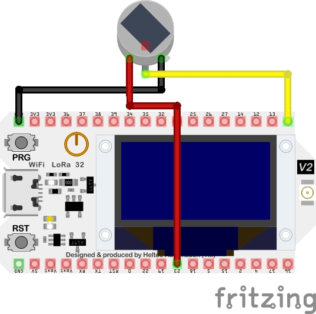

# ESP32 wireless light switch with PIR sensor

## Project Description
Using a PIR sensor, trigger a LIFX bulb controlled via local wifi network. PIR sensor will stay on for 35 seconds by default but this could be easily extended/reduced.

## Components
* ESP32-WROOM-32D
* [PIR Sensor](https://www.aliexpress.com/item/4000103425579.html?spm=a2g0o.order_list.0.0.21ef1802X6xuF9)

## Schematic

*schematic is not exact as I couldn't find a regular ESP32 or a representative PIR sensor*

## Dependencies
* WiFi library
* lifx library from [lifx-switch-esp32](https://github.com/lgruen/lifx-switch-esp32)
